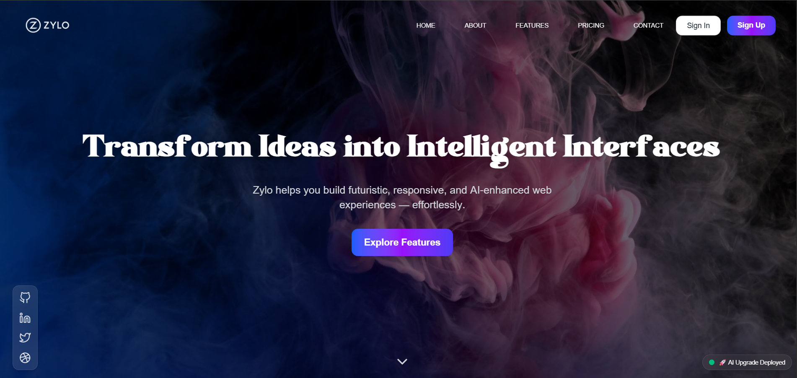

# Zylo – Intelligent UI System



## Overview

Zylo is a modern, intelligent, and futuristic UI platform built for next-generation web experiences. It features reactive layers, adaptive design, and smart UI logic for creators, teams, and developers looking to craft scalable, delightful digital interfaces.

## 🔥 Features

* ✨ GSAP-powered scroll animations
* 🎨 Futuristic and elegant UI design
* 🎥 Interactive media sections (videos, images)
* 📦 Modular React components
* 🌐 Responsive and performant

## 🚀 Tech Stack

* React.js
* Tailwind CSS
* GSAP (GreenSock Animation Platform)
* React Icons

## 📁 Folder Structure

```
zylo/
├── public/
│   └── images/
│       └── screenshot.png
├── src/
│   ├── components/
│   ├── assets/
│   ├── pages/
│   ├── App.jsx
│   └── main.jsx
├── package.json
└── tailwind.config.js
```


## 🛠️ Getting Started

```bash
git clone https://github.com/yourusername/zylo.git
cd zylo
npm install
npm run dev
```

## 📬 Contact

**Name:** Krishna
**Email:** [krishna.sahu.work@gamil.com]

## 📄 License

MIT © Krishna
